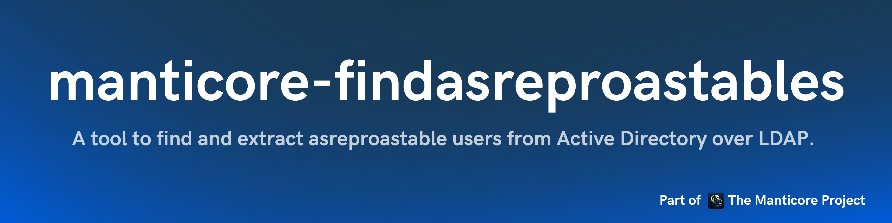

<p align="center">
      A tool to find and extract asreproastable users (users without Kerberos preauthentication requirement) from Active Directory over LDAP.
      <br>
      <a href="https://github.com/TheManticoreProject/FindAsreproastables/actions/workflows/release.yaml" title="Build"></a>
      
      
      <a href="https://twitter.com/intent/follow?screen_name=podalirius_" title="Follow"></a>
      <a href="https://www.youtube.com/c/Podalirius_?sub_confirmation=1" title="Subscribe"></a>
      <br>
</p>

## Features

- [x] Find and extract asreproastable users from Active Directory
- [x] Support for LDAP and LDAPS connections with automatic signing/encryption detection
- [x] Kerberos and NTLM authentication support
- [x] NT/LM hash authentication support
- [x] Tree-formatted output for easy reading

## Usage

```
$ ./FindAsreproastables -h
FindAsreproastables - by Remi GASCOU (Podalirius) @ TheManticoreProject - v1.0.0

Usage: FindAsreproastables --domain <string> --username <string> [--password <string>] [--hashes <string>] [--debug] --dc-ip <string> [--ldap-port <tcp port>] [--use-ldaps] [--use-kerberos]

  Configuration:
    -d, --debug      Debug mode. (default: false)

  LDAP Connection Settings:
    -dc, --dc-ip <string>       IP Address of the domain controller or KDC (Key Distribution Center) for Kerberos. If omitted, it will use the domain part (FQDN) specified in the identity parameter.
    -lp, --ldap-port <tcp port> Port number to connect to LDAP server. (default: 389)
    -L, --use-ldaps             Use LDAPS instead of LDAP. (default: false)
    -k, --use-kerberos          Use Kerberos instead of NTLM. (default: false)

  Authentication:
    -d, --domain <string>   Active Directory domain to authenticate to.
    -u, --username <string> User to authenticate as.
    -p, --password <string> Password to authenticate with. (default: "")
    -H, --hashes <string>   NT/LM hashes, format is LMhash:NThash. (default: "")
```

## Output format

Results are printed using tree-formatted output for consistency with other TheManticoreProject tools:

```
Found 3 asreproastable users:
├── CN=ServiceAccount1,CN=Users,DC=DOMAIN,DC=local
├── CN=ServiceAccount2,CN=Users,DC=DOMAIN,DC=local
└── CN=TestAccount,CN=Users,DC=DOMAIN,DC=local
Done
```

- The tool uses LDAPS (LDAP over SSL) by default when the domain controller requires signing/encryption
- NTLM or Kerberos authentication can be used for authentication
- Results include the full Distinguished Name (DN) for each asreproastable user

## Demonstration

```
$ ./FindAsreproastables -d DOMAIN.local -u Administrator -p 'P@ssw0rd!' -dc 192.168.1.10 -L -lp 636
FindAsreproastables - by Remi GASCOU (Podalirius) @ TheManticoreProject - v1.0.0

Found 2 asreproastable users:
├── CN=ServiceAccount,CN=Users,DC=DOMAIN,DC=local
└── CN=TestUser,CN=Users,DC=DOMAIN,DC=local
Done
```

## Contributing

Pull requests are welcome. Feel free to open an issue if you want to add other features.

## Credits

- [Remi GASCOU (Podalirius)](https://github.com/Podalirius) for the creation of the FindAsreproastables tool before transferring it to TheManticoreProject.
